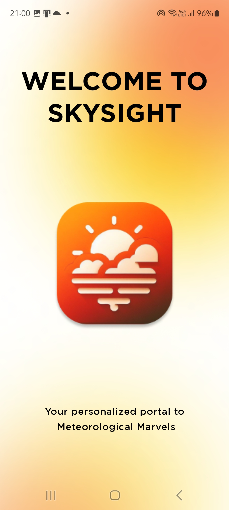
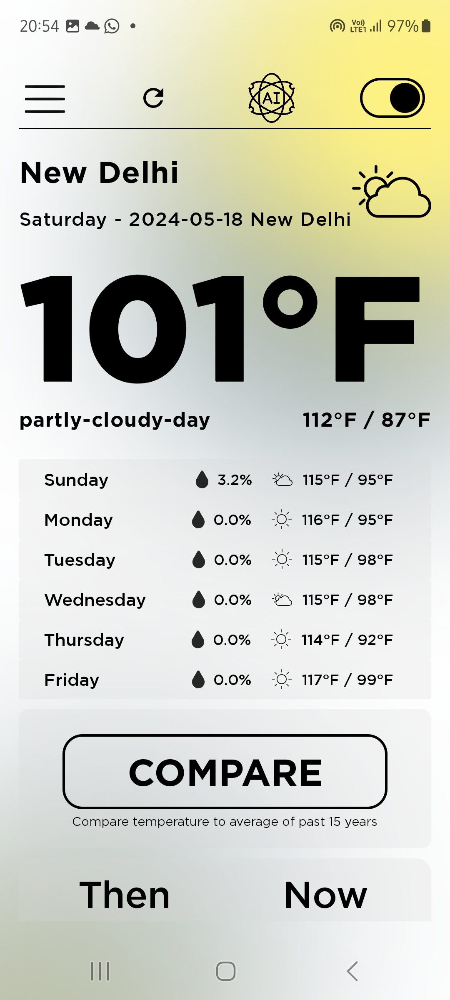
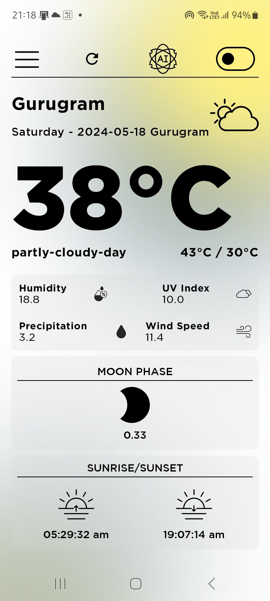
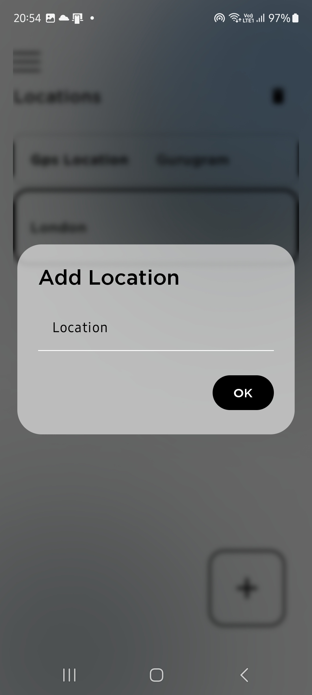
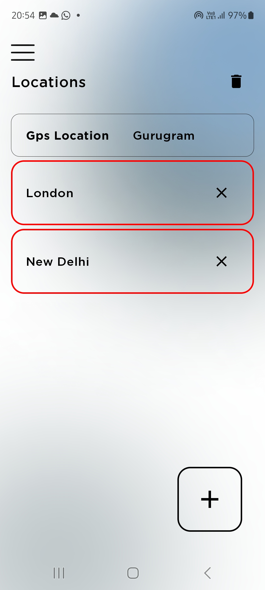
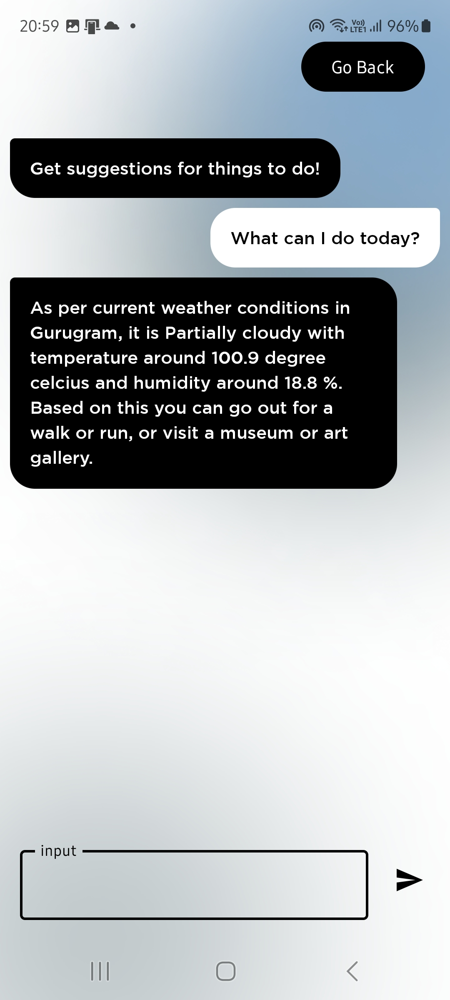

# SkySight

SkySight is a modern weather application built using Jetpack Compose. It fetches weather data from the Visual Crossing API and provides suggestions for activities based on the current weather using the Gemini 2 API.
## Screenshots

  
  
  

    
  
  

## Features

- **Live Weather Updates**: Get real-time weather information for your selected locations.
- **Add New Locations**: Easily add and manage multiple locations to get weather updates for various places.
- **Activity Suggestions**: Receive suggestions for activities based on the current weather conditions.
- **Notifications**: Get notified about weather updates directly on your device.
- **Dynamic Background and text**: Enjoy a clean and modern look with backgrounds and text that change dynamically according to the weather.

## Technologies Used

- **Jetpack Compose**: For building the user interface.
- **Visual Crossing API**: For fetching weather data.
- **Gemini 2 API**: For providing activity suggestions.
- **MVVM Pattern**: To structure the app architecture.
- **Kotlin**: The programming language used to develop the app.
- **Android Architecture Components**: Including ViewModel, LiveData, and Room for implementing MVVM.

## Design Process

SkySight was meticulously designed in Figma to ensure a clean and modern look. The user interface is not only aesthetically pleasing but also highly functional. The design process focused on creating an intuitive user experience with easy navigation and a visually appealing layout.

### Key Design Features

- **Dynamic Backgrounds**: The app features dynamic backgrounds that change according to the current weather conditions, enhancing the user experience and providing a visually immersive feel.
- **Clean and Modern Look**: SkySight boasts a clean, modern design with smooth animations and a cohesive color scheme that makes the app both attractive and easy to use.

## Development Process

### 1. App Architecture
The development of SkySight started with designing the app architecture. The app follows the Model-View-ViewModel (MVVM) pattern to separate concerns and facilitate easier testing and maintenance.

### 2. Data Repository
A data repository was created following the repository pattern, which abstracts the data sources and provides a clean API for data access. The repository handles both local database interactions and remote API calls.

### 3. ViewModel
Appropriate ViewModels were then created to manage the UI-related data in a lifecycle-conscious way. The ViewModels interact with the repository to fetch and manage data.

### 4. UI Layer
The user interface was built using Jetpack Compose, with different composable functions created for various parts of the app. This modular approach allows for a more manageable and scalable UI codebase.

## Robust Error Handling

SkySight implements robust error-handling mechanisms to ensure smooth operation. The app gracefully handles errors and provides informative messages to users, minimizing disruptions to their experience.

## Installation

To install SkySight, follow these steps:

1. **Download the APK**: Download the latest version of the SkySight APK from [this link](#https://github.com/nayan21402/SkySight-WeatherApp/blob/master/SkySight-1.2.apk).
2. **Install the APK**:
   - On your Android device, go to `Settings > Security`.
   - Enable `Unknown Sources` to allow the installation of apps from sources other than the Google Play Store.
   - Open the downloaded APK file and follow the on-screen instructions to install the app.

## Usage

1. **Open SkySight**: Launch the app from your app drawer.
2. **Set Up Locations**: Add your desired locations to get weather updates.
3. **Check Weather Updates**: View real-time weather updates for your added locations.
4. **Get Activity Suggestions**: Receive personalized activity suggestions based on the current weather conditions.
5. **Enable Notifications**: Allow notifications to stay updated with the latest weather information.

